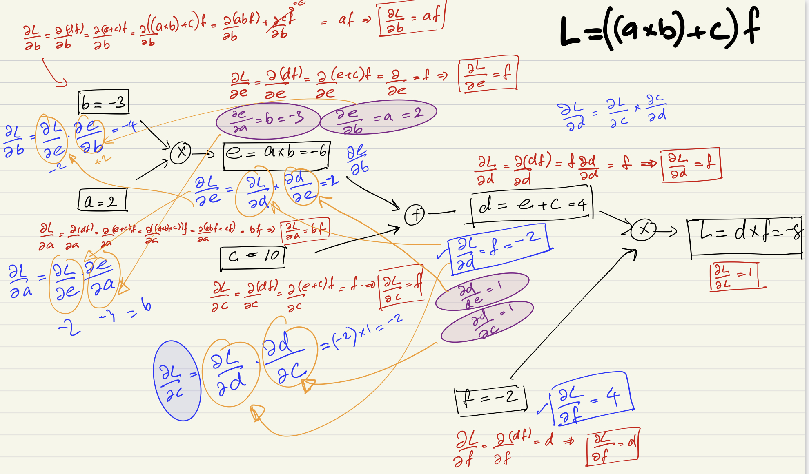

# Learning how to program a neural network from scratch

This is purly based on Andrej karpathy's lecture series. I try to build eveything by my self following his lectures and also trying to convince my self the math behind it. This is not intented to teach anybody else how to program a neural network of to give any specific instructions. This is purly for me to learn things. 

Andrej karpathy's lecture:

 - https://www.youtube.com/watch?v=VMj-3S1tku0&list=PLAqhIrjkxbuWI23v9cThsA9GvCAUhRvKZ&index=1&t=1s

Backpropogation:

